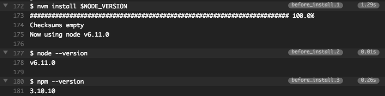
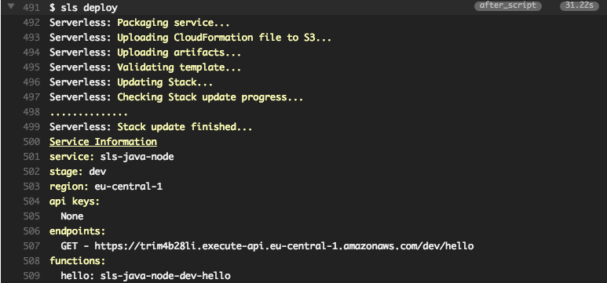
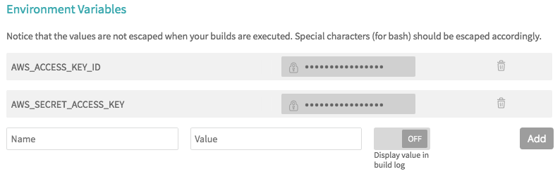

# CI/CD Pipeline with Travis CI for Java-based Serverless apps (AWS Lambda)

Running automated CI/CD _(Continuous Integration/Continuous Delivery)_ deployment pipelines is a general standard in nowadays software development.
It gives you reproducable and reliable results of your building blocks and is a _must_ for agile development and for microservices.
[Travis CI](https://travis-ci.org) is a great option for doing this free of charge for projects with a public and open source repository on GitHub.

But how do you do this for a small service, based on the [Serverless Framework](https://serverless.com)?
Sure, you can do this easily on Travis CI with running `npm install serverless -g` and then `sls deploy` when building and testing your Node.js based app, because you already have a Node/NPM environment at hand.

**But what if you have a Java-based serverless app?**  
You first have to perform a Maven (or Gradle) build in a Java based travis container and have then running the serverless framework on Node.js.
Is this possible and what's the best way to achieve this?

First of all - _yes, it is possible!_  
Luckily the Java images at Travis CI _do_ include some Node environment, we just have to use the proper version.

## Configure Travis CI

Let's start with our "regular" `.travis.yml` file for Java projects:

```yml
language: java

jdk:
  - oraclejdk8

cache:
  directories:
    - $HOME/.m2
```

So we have the Java language environment, the JDK version (8) and we are caching the Maven repository to save time and resources on subsequent builds.
If we don't configure more, our project will be regularly build and tested from Travis CI on every new push to GitHub.

For installing the proper Node.js version right on our Travis CI container, we don't need to perform a complete Node installation, because the image already comes with a Node Verion Manager ([nvm](https://github.com/creationix/nvm)) installation which we're gonna use.
We add to our `.travis.yml` file this:

```yml
env:
  - NODE_VERSION="6"

before_install:
  - nvm install $NODE_VERSION
  - node --version
  - npm --version
```

The environment variable is just to have an easy way to change the version number, if needed (I've chosen the current long term support (lts) version of node).
The important part is in the `before_install` step of the build lifecycle.
Here we tell the `nvm` to install our desired node version.
To check on the console if everything went well, I added some version calls to `node` and `npm`.
This was the output on my build:



Everything looks good so far. :-)

For installing the Serverless framework, we just have to add the npm request to the `installation` section of the build lifecycle:

```yml
install:
  - npm install -g serverless
```

The installation results in a longer console log, which I won't post here.
But it works like charm.
No problems here.
It just takes some seconds.


For the actual build of our Java sources, we can call this explicitly in the `script` section of the lifecycle.
But this is not mandatory as the standard calls (`mvn install -DskipTests` and `mvn test`) will be executed automatically.
For the sake of completeness, I've added an explicit call to maven:

```yml
script:
  - mvn clean install -B
```

After the build has succeeded (which I assume here that it does), we have to run the previously installed serverless framework to deploy our serverless app to AWS:

```yml
after_script:
  - sls deploy
```



You can see the complete file here: [.travis.yml](.travis.yml)

## Authorize Travis CI

Of course, this will only work, if you activate the automated build for your project in the Travis CI console.
Additionally, you need to provide the `AWS_ACCESS_KEY_ID` and `AWS_SECRET_ACCESS_KEY` of the AWS IAM user as environment variables, in which authority the Serverless framework should do the deployment.
The framework uses these two environment variables to authenticate with AWS.



The user must be configured in the AWS management console at IAM (Identity and Access Management) with _programmatic access_ and the proper policies.
The documentation of the serverless framework says it's the best way of giving the user administration rights, b/c it's not that clear, which single policies the user really needs and the framework and functionality is growing each day...
see https://serverless.com/framework/docs/providers/aws/guide/credentials#creating-aws-access-keys

Now, everything should work and save you lots of time and trouble.
Just let Travis CI and Serverless do the deployment for you and enjoy!
